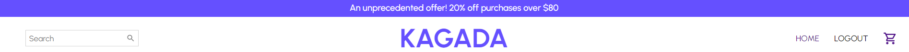

<h2 tex>EcommerceFrontend</h2>

## Description

This project was created for online trading of clothes. The project is mainly built and powered by.
 * React 
 * Redux Toolkit 
 * Styled-components 
 * UI Material
 * Stripe payments
 * Nodemailer
 

The project consists of a home page, from which an opportunity is created for the user to log in and register. The site allows you to get to know the products by category and buy online through the stripe system
 

## Features

* User registration
* User login
* User upload
* Selection of products
* cart creation
* Օnline purchase of products(Stripe payments)
* Possibility of electronic notification to the customer about new products(Nodemailer)
* Fully Responsive

## Installing

 * git clone https://github.com/Armen-Martirosyan3000/EcommerceFrontend
 * cd EcommerceFrontend
 * npm install

## Getting Started
To test the application

`npm start`
Runs the app in the development mode.\
Open (http://localhost:3000) to view it in your browser.
You may also see any lint errors in the console.

## Usage Instructions

Open the project folder and Navigate to /src/components/.
You will find all the components used and you can edit your information accordingly.
 
## Author
<h3>Armen Martirosyan</h3>

- https://github.com/Armen-Martirosyan3000
- martirosyana268@gmail.com

